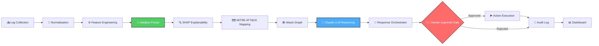

<div align="center">

# 🛡️ CyberShield
### AI-Driven Cyber Resilience for Critical National Infrastructure

*Autonomous threat detection. Human-gated response. Zero-day ready.*

[](https://github.com/your-org/cybershield/actions)
[](https://python.org)
[](https://github.com/astral-sh/ruff)
[](https://mypy.readthedocs.io)
[](#license)
[](#implementation-timeline)

</div>

---

## ⚡ What is CyberShield?

**CyberShield Autonomous Response (CAR)** is a real-time anomaly detection and autonomous incident response platform purpose-built for **critical national infrastructure (CNI)** — power grids, water systems, telecom backbones, and beyond.

<table>
<tr>
<td width="25%" align="center">🧠<br><b>Unsupervised ML</b><br><sub>Isolation Forest catches zero-days without labeled data</sub></td>
<td width="25%" align="center">🕸️<br><b>Attack Graph Reasoning</b><br><sub>NetworkX + MITRE ATT&CK maps the full kill chain</sub></td>
<td width="25%" align="center">💬<br><b>LLM Analysis</b><br><sub>Claude explains threats in plain language</sub></td>
<td width="25%" align="center">🧑‍✈️<br><b>Human-Gated Response</b><br><sub>SOC analysts approve every autonomous action</sub></td>
</tr>
</table>

> ⚡ **Current status:** Module 1.1 — Repository Foundation
> The complete pipeline ships incrementally across 4 weeks. See the [timeline](#-implementation-timeline) below.

---

## 🔄 Architecture at a Glance



📄 Full technical breakdown: [`docs/architecture.md`](docs/architecture.md)

---

## 🚀 Quick Start

### Prerequisites
- Python 3.11+
- Docker & Docker Compose
- Git

<details open>
<summary><b>1️⃣ Clone and Setup</b></summary>

```bash
git clone https://github.com/your-org/cybershield.git
cd cybershield
chmod +x scripts/setup_dev.sh
./scripts/setup_dev.sh
```
</details>

<details>
<summary><b>2️⃣ Configure Environment</b></summary>

```bash
# Edit .env with your settings
nano .env

# At minimum, set:
# SECRET_KEY=<generated-secret>
# ANTHROPIC_API_KEY=<your-key>  (required for Week 3+)
```
</details>

<details>
<summary><b>3️⃣ Run the Development Server</b></summary>

```bash
# Activate virtual environment
source .venv/bin/activate

# Start server (hot-reload)
make run
```

| Endpoint | URL |
|---|---|
| 🌐 API | http://localhost:8000 |
| ❤️ Health | http://localhost:8000/health |
| 📚 Docs | http://localhost:8000/docs |
</details>

<details>
<summary><b>4️⃣ Run Tests</b></summary>

```bash
make test        # full suite with coverage
make test-fast   # fast, no coverage
make test-unit   # unit tests only
```
</details>

<details>
<summary><b>5️⃣ Run Linting</b></summary>

```bash
make lint        # ruff + mypy
```
</details>

---

## 📁 Project Structure

```
cybershield/
├── backend/
│   ├── core/           # Config, logging, exceptions, health checks
│   ├── shared/         # Types, base models, utilities
│   ├── ingestion/      # [Week 1] Log collection
│   ├── normalization/  # [Week 1] Log parsing & normalisation
│   ├── features/       # [Week 1] Feature engineering
│   ├── detection/      # [Week 2] Isolation Forest
│   ├── explainability/ # [Week 2] SHAP explanations
│   ├── mitre/          # [Week 2] MITRE ATT&CK mapping
│   ├── graph/          # [Week 2] Attack graph reasoning
│   ├── llm/            # [Week 3] Claude enrichment
│   ├── response/       # [Week 3] Response orchestration
│   ├── audit/          # [Week 3] Audit logging
│   ├── dashboard/      # [Week 4] Metrics API
│   └── api/            # FastAPI application layer
├── tests/
│   ├── unit/           # Fast, isolated unit tests
│   └── integration/    # End-to-end HTTP tests
├── data/               # Data artifacts (gitignored)
├── models/             # Trained model files (gitignored)
├── docker/             # Dockerfiles and compose
├── scripts/            # Developer tooling
├── docs/               # Architecture and developer docs
└── reports/            # Generated reports (gitignored)
```

---

## 🛠️ Development Workflow

| Command | Description |
|---------|-------------|
| `make install` | Set up dev environment |
| `make run` | Start dev server with hot-reload |
| `make test` | Run full test suite |
| `make test-fast` | Run tests (no coverage) |
| `make lint` | Run ruff + mypy |
| `make docker-up` | Start services via Docker |
| `make clean` | Remove generated artifacts |
| `make help` | Show all available targets |

---

## 🧰 Technology Stack

<div align="center">

| Layer | Technology |
|:---:|:---:|
| Language |  |
| Web Framework |  |
| ML | scikit-learn (Isolation Forest) |
| Explainability | SHAP |
| Graph | NetworkX |
| LLM | Anthropic Claude |
| Logging | structlog (JSON) |
| Config | Pydantic Settings |
| Database | SQLite (dev) → PostgreSQL (prod) |
| Container |  |
| Testing | pytest + pytest-cov |
| Linting | ruff + mypy |

</div>

---

## 📚 Documentation

| Document | Description |
|----------|-------------|
| [docs/architecture.md](docs/architecture.md) | Full system architecture |
| [docs/developer_guide.md](docs/developer_guide.md) | Contributing guide |
| [docs/module_contracts.md](docs/module_contracts.md) | Module interfaces |
| [docs/adr/](docs/adr/) | Architecture Decision Records |

---

## 🗓️ Implementation Timeline

| Week | Module | Status |
|:---:|---|:---:|
| 0 | Learning + Research | ✅ Complete |
| **1** | **1.1 Repository Foundation** | ✅ **This PR** |
| 1 | 1.2–1.4 Log Pipeline + Features | ⏳ Next |
| 2 | 2.x ML + Graph Engine | ⏳ Planned |
| 3 | 3.x LLM + Response | ⏳ Planned |
| 4 | 4.x Polish + Demo | ⏳ Planned |

```
Progress: [██░░░░░░░░░░░░░░░░░░] 1/5 weeks
```

---

## 📄 License

Proprietary — CyberShield Team. All rights reserved.

<div align="center">
<sub>Built with 🛡️ for the infrastructure that keeps the lights on.</sub>
</div>
